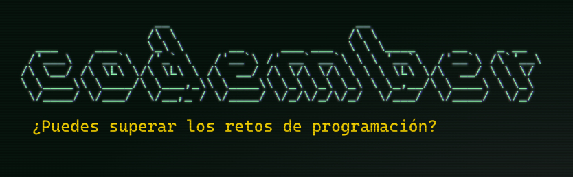

  

# Bienvenidos al Reto Codember 2023 :sparkles:

¡Hola a todos! :wave:

Este año me he lanzado a la emocionante aventura de participar en el reto de **Codember 2023**, creado por [@Midudev](https://www.twitch.tv/midudev). Para abordar los desafíos, he decidido utilizar [ExpressJS](https://expressjs.com/).

A lo largo del reto, iré actualizando este repositorio con mis soluciones a los retos planteados. Estoy totalmente abierto a sugerencias y comentarios constructivos, ¡así que no dudes en dejar tu feedback!

## Lista de Soluciones:

- [Solución 1](https://github.com/davidbenadev/codember2023/blob/main/challenge01/index.js)
- [Solución 2](https://github.com/davidbenadev/codember2023/blob/main/challenge02/index.js)

¿Te gustaría participar también? Únete al reto de **Codember 2023** siguiendo este [enlace](https://codember.dev/).

Happy coding! :rocket:
